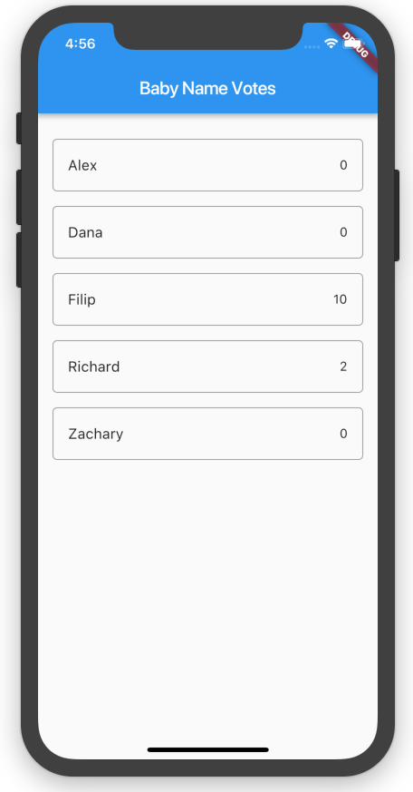
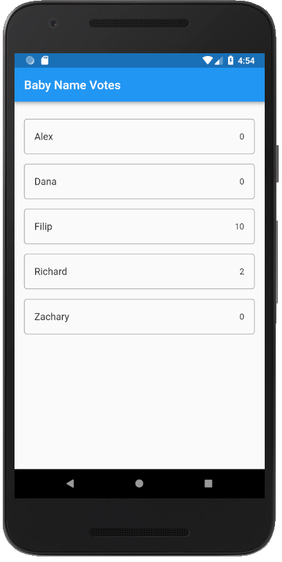
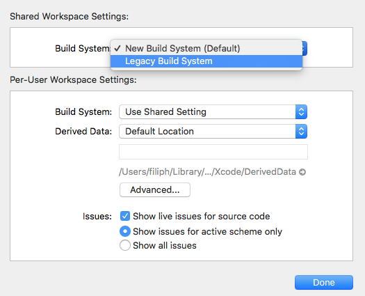
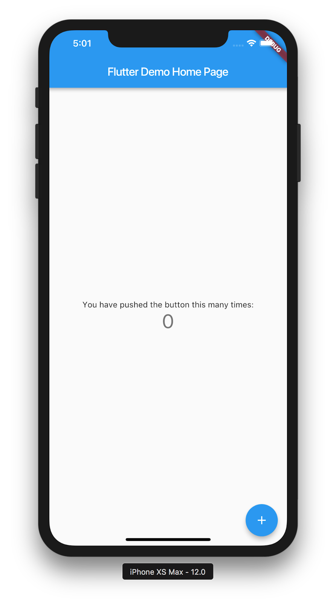
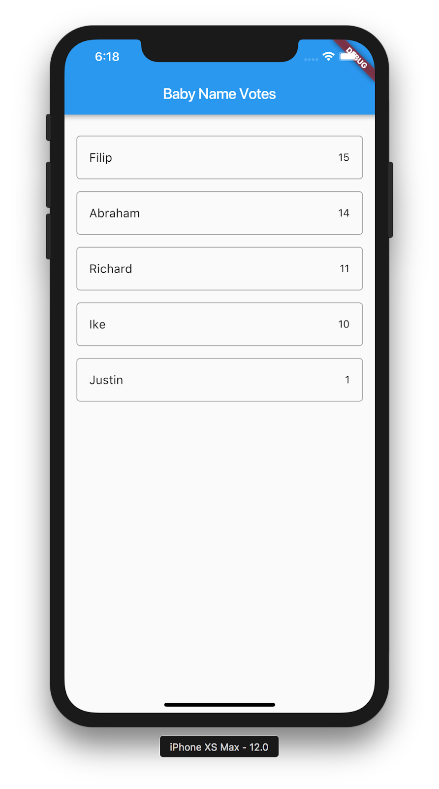
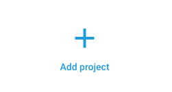
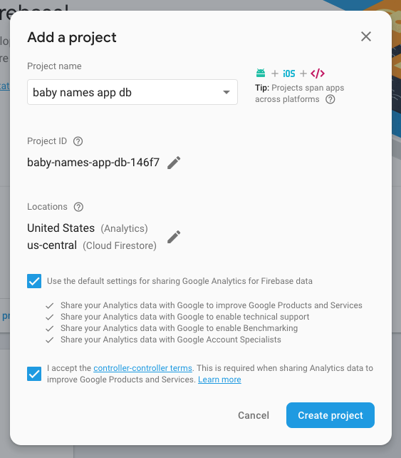

# firebase for flutter

## 1. Prerequisites

구글 코드랩스의 [firebase for flutter](https://codelabs.developers.google.com/codelabs/flutter-firebase/#0)
강의에 대한 소스코드 리포지토리 입니다.
주석 및 설명은 모두 한글을 기본으로 사용합니다.

[startup_namer](https://github.com/flutter-tutorial/startup_namer) 부터 
순서대로 연습하는것을 추천합니다.

## 2. Introduction

플러터 (flutter) 와 파이어베이스 (firebase) 는 매우 밀접히 연결되어 있어서 개발자가 빠르게 앱을 개발할 수 있도록 돕습니다.
[플러터](https://flutter.io/) 는 iOS와 안드로이드의 앱을 만들기 위해 google이 제공하는 SDK 입니다.
[파이어베이스](https://firebase.google.com/) 는 모바일 애플리케이션을 위한 백엔드 서비스들을 쉽게 구축하고 사용할 수 있도록
도와주는 서비스로, 인증/스토리지/데이터베이스/호스팅 등의 다양한 기능을 개인 서버 구축을 하지 않고 사용할 수 있도록 합니다.

이번 코드랩에서는 파이어베이스를 사용하는 플러터 앱을 만드는 방법을 다룹니다. 실제로 만들어볼 앱은 새로 태어날 아기의 이름을
주변 지인들의 투표로 결정하는 앱입니다. 앱에서는 [클라우드 파이어스토어(Cloud Firestore)](https://firebase.google.com/products/firestore/)
데이터베이스를 사용하여 데이터를 관리하게 됩니다.

안드로이드와 iOS에서 보여질 앱의 전체 형태는 아래와 같습니다. 아래에서 볼 수 있듯이, 플러터를 사용하면
iOS와 안드로이드 앱을 동시에 같은 코드로 개발할 수 있습니다.

 

비슷한 동영상 강좌는 [이 링크](https://youtu.be/DqJ_KjFzL9I?list=PLOU2XLYxmsIJ7dsVN4iRuA7BT8XHzGtCr)에서 확인하실 수 있습니다.
해당 동영상에서는 본 코드랩 강의 전체적인 스텝을 쉽게 이해할 수 있도록 돕는 좋은 영상입니다.

## 3. 플러터 개발 환경 세팅하기

플러터 개발 환경 세팅은 [이 링크](https://codelabs.developers.google.com/codelabs/flutter-firebase/index.html?index=..%2F..%2Findex#2)
를 참조하기 바랍니다.

## 새로운 플러터 앱 환경 만들고 패키지 의존성 설정하기

1. 플러터를 이용하여 새로운 앱을 개발하기 위해, [Get started](https://flutter.io/get-started/test-drive/) 가이드를
참조하여 플러터 프로젝트를 생성합니다. 앱의 이름은 `baby_names`로 설정합니다.
새로운 플러터 프로젝트를 생성하고 설정하는 것은 사용하는 코드 에디터에 따라 다르므로 매뉴얼을 참고하기 바랍니다.
> 안드로이드 스튜디오를 사용하는 경우 [플러그인](https://flutter.io/get-started/editor/#androidstudio) 을 설치하면
> 더욱 쉽게 개발할 수 있습니다.

2. 앱을 실행하기 전에 3, 4번 단계를 먼저 수행합니다.
3. `pubspec.yaml`을 연 뒤 dependencies 태그에 `cloud_firestore` 를 추가합니다. 
```yaml
dependencies:
    flutter:
        sdk: flutter
    cloud_firestore: ^0.8.2  #새롭게 추가할 코드
```
> cloud firestore의 최신 버전은 [여기](https://pub.dartlang.org/packages/cloud_firestore)에서 확인할 수 있습니다. 패키지 의존성 설정 관련해서는 [이 링크](https://www.dartlang.org/tools/pub/dependencies)
> 를 참조하기 바랍니다.

4. 사용하는 IDE에서나 커맨드 라인에서 `flutter packages get` 을 실행합니다.

새로운 `dependencies` 를 추가 할때는 tab이 아닌 스페이스를 사용하기 바랍니다. 

#### 안드로이드 sdk 버전 설정하기 

본 프로젝트를 위해서 안드로이드 에서는 **multi dex**를 지원해야 합니다. 
안드로이드 sdk 버전 21부터 지원되므로 아래의 순서로 안드로이드 컴파일 설정을 수정해야 합니다.
1. `android/app/build.gradle` 파일을 연뒤 `minSdkVersion 16` 부분을 찾습니다.
2. 해당 부분을 `minSdkVersion 21` 로 변경합니다.
3. 파일을 저장 합니다.

#### iOS를 위한 Xcode 빌드 에러 방지하기

1. 플러터 프로젝트의 최상위 폴더에서 `open ios/Runner.xcworkspace` 명령을 통해 Xcode 프로젝트를 엽니다.
2. Xcode가 열리면 `File > Workspace Settings` 메뉴에서 **build system** 을 `Legacy Build System` 으로 변경 합니다. (아래의 스크린샷 참조)



4. Done 을 클릭하고 Xcode를 종료합니다. 

이후에는 정상적으로 플러터가 실행되어야 합니다.

## 5. 기본 앱을 변경하여 새로운 유저 인터페이스 적용하기

1. [Get started: 테스트 드라이브](https://flutter.io/docs/get-started/test-drive) 를 참조하여 일단 기본 상태의 앱을 디바이스나 에뮬레이터에 설치하고 실행시킵니다.

제일 처음에는 앱을 빌드하기위해 수분의 시간을 소요하지만, 이 이후에는 **hot-reloaded** 기능으로 인해 컴파일 시간을 기다릴 필요가 없어집니다.

앱이 구동되면 아래와 같은 화면을 볼 수 있습니다.



2. 자신이 사용하는 IDE 나 에디터를 사용하여 `lib/main.dart` 파일을 열고 초기 코드를 수정합니다.
3. `main.dart` 의 코드를 아래의 코드로 모드 변경합니다.

```dart
import 'package:cloud_firestore/cloud_firestore.dart';
import 'package:flutter/material.dart';

void main() => runApp(MyApp());

final dummySnapshot = [
 {"name": "Filip", "votes": 15},
 {"name": "Abraham", "votes": 14},
 {"name": "Richard", "votes": 11},
 {"name": "Ike", "votes": 10},
 {"name": "Justin", "votes": 1},
];

class MyApp extends StatelessWidget {
 @override
 Widget build(BuildContext context) {
   return MaterialApp(
     title: 'Baby Names',
     home: MyHomePage(),
   );
 }
}

class MyHomePage extends StatefulWidget {
 @override
 _MyHomePageState createState() {
   return _MyHomePageState();
 }
}

class _MyHomePageState extends State<MyHomePage> {
 @override
 Widget build(BuildContext context) {
   return Scaffold(
     appBar: AppBar(title: Text('Baby Name Votes')),
     body: _buildBody(context),
   );
 }

 Widget _buildBody(BuildContext context) {
   // TODO: get actual snapshot from Cloud Firestore
   return _buildList(context, dummySnapshot);
 }

 Widget _buildList(BuildContext context, List<Map> snapshot) {
   return ListView(
     padding: const EdgeInsets.only(top: 20.0),
     children: snapshot.map((data) => _buildListItem(context, data)).toList(),
   );
 }

 Widget _buildListItem(BuildContext context, Map data) {
   final record = Record.fromMap(data);

   return Padding(
     key: ValueKey(record.name),
     padding: const EdgeInsets.symmetric(horizontal: 16.0, vertical: 8.0),
     child: Container(
       decoration: BoxDecoration(
         border: Border.all(color: Colors.grey),
         borderRadius: BorderRadius.circular(5.0),
       ),
       child: ListTile(
         title: Text(record.name),
         trailing: Text(record.votes.toString()),
         onTap: () => print(record),
       ),
     ),
   );
 }
}

class Record {
 final String name;
 final int votes;
 final DocumentReference reference;

 Record.fromMap(Map<String, dynamic> map, {this.reference})
     : assert(map['name'] != null),
       assert(map['votes'] != null),
       name = map['name'],
       votes = map['votes'];

 Record.fromSnapshot(DocumentSnapshot snapshot)
     : this.fromMap(snapshot.data, reference: snapshot.reference);

 @override
 String toString() => "Record<$name:$votes>";
}
```

4. 파일을 저장하고 hot-reload 되면 앱을 확인합니다.

- IDE를 사용하고 있다면 파일을 저장하는 것만으로도 핫리로드가 트리거 됩니다.
- 일반 에디터를 사용하고 있다면, `flutter run` 을 실행한 터미널에서 `r` 키를 눌러 핫 리로드를 수행합니다.

수행된 결과는 아래의 그림과 같아야 합니다.



현재 앱은 아무런 기능이 추가되어 있지 않은 단순한 목업 상태입니다. 앱의 리스트를 클릭할 경우 해당 리스트의 내용이 터미널 콘솔에 표시됩니다.

다음으로 할 일은 앱을 파이어베이스의 클라우드 파이어스토어 서비스와 연동하는 것입니다. 그 전에 코드를 이해하기 위해 `main.dart` 의 코드 구조를 한번 살펴보길 바랍니다.

> **Optional**: 복사 붙여넣기한 `main.dart` 코드를 이해하기 위해 아래의 내용을 읽어보길 권장합니다.
>
> 처음 절반의 내용은 매우 알아보기 쉽게 직관적인 코드들로 구성되어 있습니다.
>
> - `cloud_firestore.dart` 패키지를 임포트 해서 클라우드 파이어스토어 서비스를 이용할 준비
> - 클라우드 파이어스토어와 연동하기 이전에 화면에 표시할 몇개의 더미 데이터
> - 앱의 이름을 **Baby Names** 로 설정
>
> 복잡해지고 흥미로워 지는 부분은 `_MyHomePageState` 부터 시작됩니다. `build` 메소드는 [위젯 계층 구조를 정의할 때 사용하여](https://flutter.io/widgets-intro/) 앱의 화면을 디스플레이에 표기할 때 플러터가 사용하는 메소드입니다.
>
> - **Baby Name Votes** 라고 정의된 `AppBar` 를 설정
> - 앱의 기본 body는 `ListView` 를 포함하여 더미 데이터 리스트의 각 아이템을 화면에 렌더링 하는데 사용
>
> 코드 중에서 가장 긴 메소드는 `_buildListItem` 으로 각 리스트에 더미 데이터들을 어떤식으로 빌드 할 것인지 설정하는 코드입니다. (본 코드에서는 원형 모서리를 가진 사각형으로 테두리를 표현하고, 내부에는 아기 이름과 투표 수를 보여주고 있습니다.)
>
> 마지막으로 `Record` 클래스는 각 아기 이름마다의 투표상황을 쉽게 관리하기 위한 도구입니다. 실제로 앱을 만들 때에는 이러한 클래스를 반드시 만들 필요는 없으나, 코드를 깔끔하게 짜는데 도움을 줍니다.

## 6. 새로운 파이어베이스 프로젝트 만들기

1. [파이어베이스에 로그인](https://firebase.google.com/) 합니다. (없다면 계정을 생성하세요. 무료 플랜을 사용하면 대부분의 테스트 앱을 개발하기에 충분합니다.)
2. [파이어베이스 콘솔](https://console.firebase.google.com/) 에서 **Add project** 를 클릭합니다.



3. 아래의 예제 화면에서 보여 주듯이 사용할 파이어베이스 프로젝트 이름을 편하게 설정하고, 국가/지역 설정도 사용자에 맞게 설정한 뒤 **Create Project** 버튼을 눌러 프로젝트를 생성합니다.
4. 몇 초에서 수분 사이의 시간이 지난뒤 파이어베이스 프로젝트가 성공적으로 생성되면 **Continue** 를 눌러서 다음 작업을 진행합니다.



